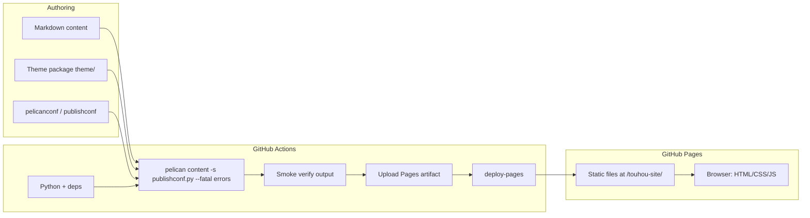
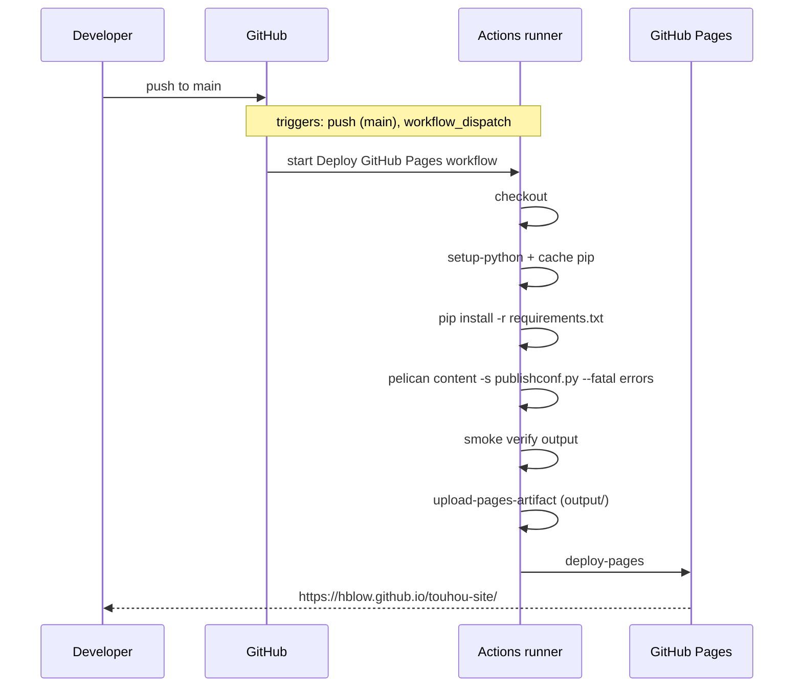
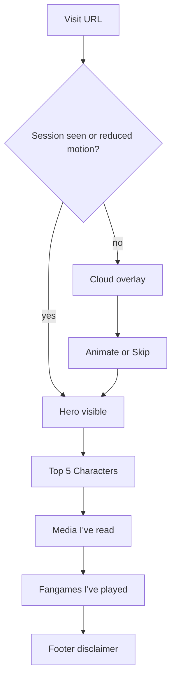
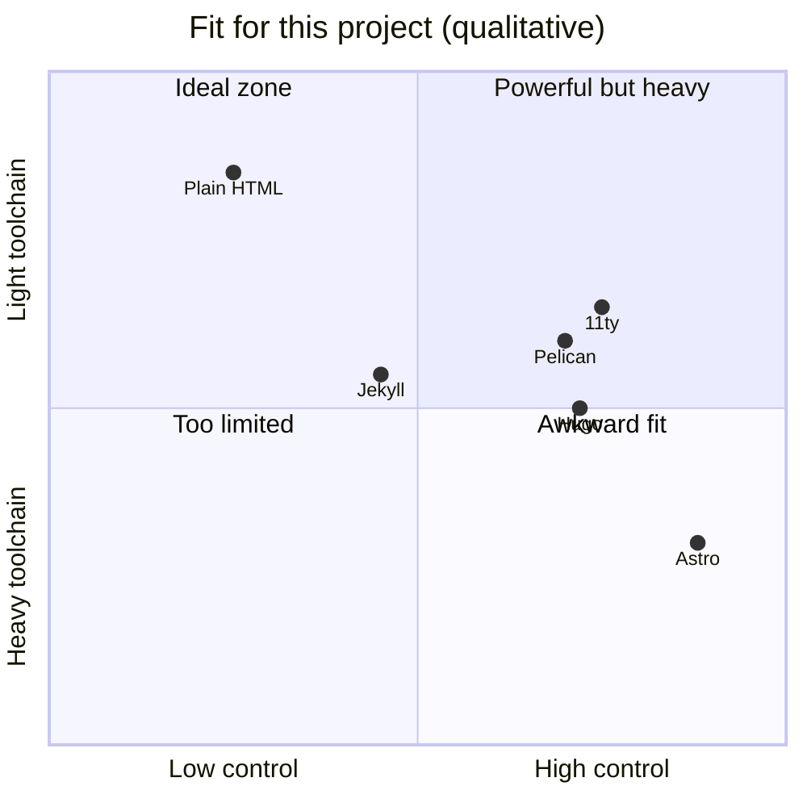
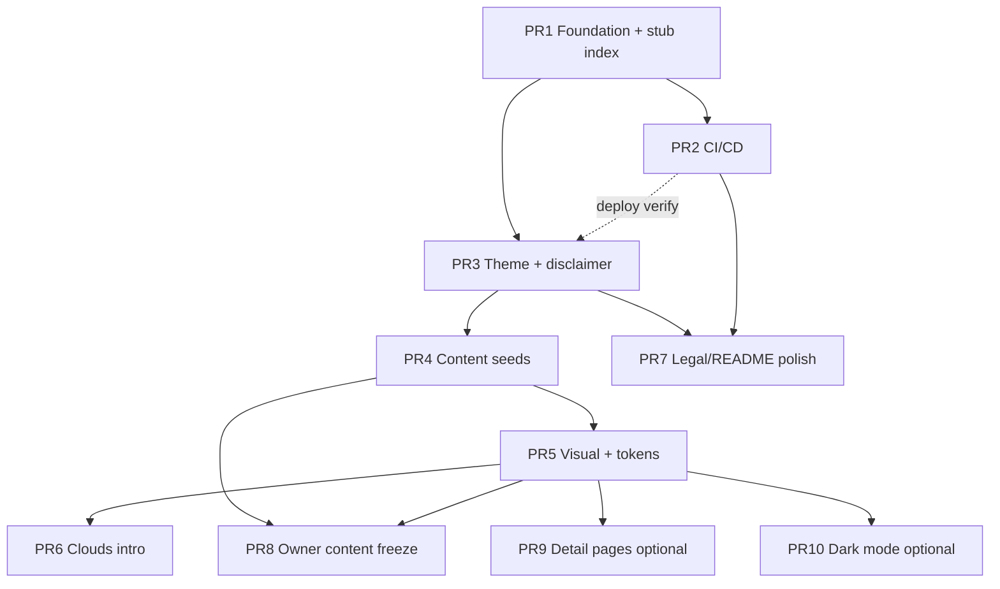

# Touhou Personal Fan Site — Design Document

| Field | Value |
|-------|-------|
| **Title** | Touhou Personal Fan Site (hblow/touhou-site) |
| **Author** | TBD display name (GitHub: `hblow`) — see Open Questions |
| **Date** | 2026-07-08 |
| **Status** | Draft (revised after design review) |
| **Repo** | https://github.com/hblow/touhou-site.git |
| **Local path** | `/mnt/c/Users/Sabel/Desktop/Workstuff/testbed/touhou-site` |
| **Expected URL** | https://hblow.github.io/touhou-site/ |
| **Hosting** | GitHub Pages (project site, base path `/touhou-site/`) |
| **SSG** | Pelican (Python static site generator) |
| **Theme package** | `theme/` (directory name = Pelican `THEME`; product nickname **celestial**) |

---

## Overview

This document specifies the architecture, content model, custom theme UX, and CI/CD for a personal Touhou Project fan site. The site celebrates the franchise with a Tenshi Hinanawi–inspired “heaven parting clouds” intro, ranked favorite characters, and curated lists of media and fangames. It is a **static**, content-driven site generated by **Pelican**, deployed free via **GitHub Actions → GitHub Pages**.

The repository is currently greenfield (`README.md` only, first commit on `main`). v1 is intentionally a **single-page landing** with scroll sections: Pelican acts as a **content + build shell**, not default blog chrome. A custom theme (`THEME = "theme"`, product name **celestial**) owns layout, palette, and the cloud-parting front-end effect. Production `SITEURL` must be `https://hblow.github.io/touhou-site` (**no trailing slash** — Pelican convention; the public URL may still show a trailing slash in the browser). Fan-use copyright respect for ZUN / Team Shanghai Alice is non-negotiable and **ships in the theme footer before any fan content merges to `main`**.

---

## Background & Motivation

### Current state

- Remote: `https://github.com/hblow/touhou-site.git` (user `hblow`)
- Branch: `main`, one commit (`first commit`)
- Contents: `README.md` with `# touhou-site` only
- No theme, content, config, or workflows yet

### Why this site

The owner wants a durable, low-cost personal shrine for Touhou fandom—especially Tenshi Hinanawi—without running a server or paying for hosting. GitHub Pages + a static generator fits: free HTTPS, git-backed content, and zero runtime ops.

### Pain points to avoid

| Pain | Mitigation in this design |
|------|---------------------------|
| Jekyll is GH Pages–native but not preferred | Use Pelican + custom Actions deploy |
| Default Pelican looks like a blog | Custom theme from day one; suppress unused blog chrome |
| Broken assets on project Pages (`/touhou-site/`) | Dual config + CI smoke assertions on prod asset URLs |
| Heavy animation a11y issues | `prefers-reduced-motion`, skip control, once-per-session `sessionStorage` |
| Copyright / fan-content risk | Disclaimer in theme from PR3; art checklist; official fan guidelines citation |
| Accidental empty sections from drafts | Never seed with Pelican `status: draft`; domain status fields renamed |

### Constraints

1. **Static only** — no server-side runtime, no secrets in the client bundle beyond public config.
2. **Free hosting** — GitHub Pages project site (not `hblow.github.io` user root).
3. **Pelican preferred** — escape hatch: plain HTML or 11ty if Pelican fights the single-page model (see **spike gate** under Alternatives).
4. **Legal / community norms** — non-official fan site; credit ZUN / Team Shanghai Alice; follow official fan-creation guidelines; no claiming ownership of Touhou IP.

---

## Goals & Non-Goals

### Goals (v1)

1. Deploy a working site at `https://hblow.github.io/touhou-site/` from `main` via GitHub Actions.
2. Deliver a **clouds-parting intro** (CSS/SVG/JS) themed around Tenshi / heavenly sky, once per browser session, skippable, motion-safe.
3. Present **Top 5 characters** as ranked cards (portrait placeholder, name, short blurb).
4. Present **Media I've read** and **Fangames I've played** as scannable content sections.
5. Use **Pelican** with a **custom theme** and Markdown as the content source.
6. Include a visible **fan-site / copyright disclaimer** in the shared footer on **every generated HTML page** (landing **and** soft-multipage `articles/*.html` / pages) **before** fan content is public.
7. Keep the architecture **extensible** for character pages, richer reviews, blog posts, etc., without implementing those in v1.

### Non-Goals (v1)

- User accounts, comments, forms backends, or databases.
- Official game assets packaging or commercial merch sales.
- Multi-author CMS workflows.
- Perfect pixel recreation of official art styles or full game audio.
- SEO dominance / content marketing.
- Custom domain (documented as future only).
- Native GitHub Pages Jekyll pipeline.
- Per-article public pages (deferred to optional PR9; see output contract).
- YAML data loader plugin (directory reserved only).

### Launch milestones

| Milestone | Definition |
|-----------|------------|
| **Placeholder launch** | PR1–PR7 (and technical pieces of content schema) live: green Actions, SITEURL-correct assets, sections render with placeholder blurbs/portraits, disclaimer visible, clouds work. Open Questions may still be unresolved. |
| **Content complete** | PR8 owner content freeze: real Top 5, media, fangames copy; art only if checklist-cleared. Product title/tagline finalized if ready. |

---

## Proposed Design

### High-level architecture



**Build-time:** Pelican reads content + theme, emits pure HTML/CSS/JS into `output/`.  
**Run-time:** Browser only. Cloud animation, nav, and progressive enhancement are client-side.

### Repository layout

Target tree (source-only on `main`; **do not commit** `output/`):

```text
touhou-site/
├── README.md
├── LICENSE                      # MIT (or similar) for *site code only* — not Touhou IP
├── requirements.txt             # exact pins set in PR1
├── pelicanconf.py               # local / default settings
├── publishconf.py               # production overrides (SITEURL, etc.)
├── content/
│   ├── pages/
│   │   └── .gitkeep             # optional later pages (about); NOT the landing index
│   ├── characters/
│   │   └── *.md                 # one file per character (Top 5 seeds in PR4)
│   ├── media/
│   │   └── *.md
│   ├── fangames/
│   │   └── *.md
│   └── images/                  # CONTENT static assets (STATIC_PATHS)
│       └── placeholders/
│           ├── character.svg    # generic portrait placeholder
│           ├── media.svg
│           └── fangame.svg
├── theme/                       # THEME root (product name: celestial)
│   ├── templates/
│   │   ├── base.html
│   │   ├── index.html           # ONLY public landing page composition
│   │   ├── page.html            # generic pages if added later
│   │   ├── article.html         # minimal fallback (articles not linked in v1)
│   │   └── partials/
│   │       ├── nav.html
│   │       ├── characters.html
│   │       ├── media.html
│   │       ├── fangames.html
│   │       ├── footer.html      # disclaimer lives here from PR3
│   │       └── clouds.html
│   └── static/                  # copied → output/theme/ (see theme static contract)
│       ├── css/
│       │   ├── base.css         # :root design tokens required in PR5
│       │   ├── sections.css
│       │   └── clouds.css
│       ├── js/
│       │   └── clouds.js
│       └── svg/
│           └── clouds.svg
├── data/                        # RESERVED empty for future YAML scale-out (no loader in v1)
│   └── README.md                # explains reserved purpose; no *.yaml shipped in v1
├── plugins/                     # RESERVED; empty in v1 (no custom plugins required)
│   └── .gitkeep
└── .github/
    └── workflows/
        ├── pages.yml            # build + verify + deploy on main
        └── pr-check.yml         # build + verify only on PRs
```

**Notes on layout choices**

- `content/` + `theme/` + dual conf files are idiomatic Pelican.
- **No `content/pages/home.md` for the landing.** The public root is solely `theme/templates/index.html` via Pelican’s `index` direct template. Avoids dual-index ambiguity.
- `data/` is an **empty reserved path** in v1 (README only) — not a second content system until scale demands it.
- `plugins/` is reserved empty; v1 needs no custom plugin if templates filter `articles` by category.
- `.gitignore` must include `output/`, `__pycache__/`, `.venv/`, `.DS_Store`.

---

### v1 Pelican output contract

This subsection is the **authoritative generation contract** for implementers. Do not improvise alternate index strategies in v1.

#### Public surface (what visitors should use)

| URL (under SITEURL) | Source | v1 intent |
|---------------------|--------|-----------|
| `/` → `output/index.html` | `theme/templates/index.html` | **Only** landing: hero, Top 5, media, fangames, footer disclaimer, cloud overlay |
| `/theme/*` | `theme/static/*` copied to `output/theme/*` | CSS, JS, decorative SVG |
| `/images/*` | `content/images/*` via `STATIC_PATHS` | Portrait/cover placeholders and future content images |

#### Landing composition (chosen approach)

**Landing = custom `theme/templates/index.html`** consuming the Pelican `articles` (and/or `categories`) context.  
**Not** a Page with `save_as: index.html`.  
**Not** `content/pages/home.md` as the root.

`index.html` structure:

1. Extends `base.html` (or is the full document that includes partials).
2. Includes cloud partial, nav, hero (`#home`).
3. Includes `partials/characters.html` — filters published articles in category `characters`, applies Rank rules, renders Top 5 cards.
4. Includes `partials/media.html` — category `media`.
5. Includes `partials/fangames.html` — category `fangames`.
6. Includes `partials/footer.html` — disclaimer (mandatory).

#### Article HTML generation in v1

Pelican will still **generate** per-article HTML files by default if `ARTICLE_SAVE_AS` is set. For v1:

| Setting | v1 value | Rationale |
|---------|----------|-----------|
| `ARTICLE_URL` | `'articles/{slug}.html'` | Stable slug path reserved for PR9; not linked from UI in v1 |
| `ARTICLE_SAVE_AS` | `'articles/{slug}.html'` | Files exist but are **soft multipage** / unlinked implementation detail |
| Card links (v1) | **None** (cards are `<article>` / `<div>`, not `<a>`) | Avoid advertising incomplete detail pages |
| Card links (PR9) | Wrap card (or title) in `<a href="{{ SITEURL }}/{{ article.url }}">` | When `article.html` / category templates are productized |
| Disclaimer on article/page HTML | **Mandatory** — same footer as landing | Goal 6: legal baseline on every generated HTML page, including soft multipage |

**Soft-multipage template rule (non-negotiable with Goal 6):**

- `theme/templates/article.html` and `theme/templates/page.html` **must** `` (or include the identical footer partial chain).
- `base.html` **must** render `partials/footer.html` (from PR3 onward) so every generated page carries the disclaimer — not only `index.html`.
- “Minimal fallback” means **minimal body content** (title + summary), **not** a bare HTML document without chrome/footer.
- Optional de-emphasis until PR9: `<meta name="robots" content="noindex,nofollow">` in `article.html` so unlinked soft pages are not advertised to crawlers. Disclaimer still required.

**Why keep article files instead of `ARTICLE_SAVE_AS = ''`?**  
Preserves a zero-config path to PR9 (character detail pages) and avoids a later conf flip that rewrites URL strategy. They are not part of the v1 IA; robots/nav do not advertise them. If the owner prefers a hard single-file site, switch to `ARTICLE_SAVE_AS = ''` and `ARTICLE_URL = ''` in one conf change — not required.

#### Disable unused Pelican chrome

```python
# pelicanconf.py — v1 output contract (canonical)
PATH = "content"
ARTICLE_PATHS = ["characters", "media", "fangames"]
PAGE_PATHS = ["pages"]
# pages may be empty in v1

ARTICLE_URL = "articles/{slug}.html"
ARTICLE_SAVE_AS = "articles/{slug}.html"
PAGE_URL = "pages/{slug}.html"
PAGE_SAVE_AS = "pages/{slug}.html"

# Suppress blog-index chrome that fights single-page UX
CATEGORY_SAVE_AS = ""
CATEGORY_URL = ""
TAG_SAVE_AS = ""
TAG_URL = ""
AUTHOR_SAVE_AS = ""
AUTHOR_URL = ""
ARCHIVES_SAVE_AS = ""
YEAR_ARCHIVE_SAVE_AS = ""
MONTH_ARCHIVE_SAVE_AS = ""
DAY_ARCHIVE_SAVE_AS = ""
AUTHORS_SAVE_AS = ""
CATEGORIES_SAVE_AS = ""
TAGS_SAVE_AS = ""

DIRECT_TEMPLATES = ["index"]  # only index; no archives/tags/authors/categories pages
PAGINATED_TEMPLATES = {}
DEFAULT_PAGINATION = False

# Feeds off until blog exists — theme MUST NOT render feed <link> when None
FEED_ALL_ATOM = None
CATEGORY_FEED_ATOM = None
TRANSLATION_FEED_ATOM = None
AUTHOR_FEED_ATOM = None
AUTHOR_FEED_RSS = None
```

#### Interaction of pieces (explicit non-goals)

| Piece | Role in v1 |
|-------|------------|
| `theme/templates/index.html` | Sole landing composer |
| `content/pages/*` | Unused or future secondary pages — **does not** replace index |
| Per-article `output/articles/*.html` | Generated, unlinked; detail UX is PR9 |
| `data/*.yaml` | Not used in v1 |

---

### Content model

#### Strategy: Markdown-per-item (v1 decision)

For v1, **one Markdown file per item** under `content/{characters,media,fangames}/` with Pelican metadata. This is a **Key Decision**, not an open fork:

- Natural path to detail pages (PR9) without a data migration.
- YAML `data/` remains **reserved only** until item count or filtering pain justifies a loader plugin.

#### Character content schema (Markdown)

```markdown
Title: Tenshi Hinanawi
Slug: tenshi-hinanawi
Category: characters
Date: 2026-07-08
Rank: 1
Portrait: images/placeholders/character.svg
Tags: scarlet-weather-rhapsody, heaven
Summary: Why she's #1 — peachy sky energy, Hisou no Tsurugi, unapologetic celestial vibes.

Short blurb or longer notes for a future detail page.
```

**Publication status:** Omit Pelican’s `Status` field (defaults to **published**), or set `Status: published` explicitly. **Never** seed examples with `Status: draft` — drafts are excluded from the default generation set and produce empty Top 5 sections in production.

Pelican reserved `status` values only: `published` | `draft` | `hidden`.  
Do **not** overload `Status` for “completed/reading” domain meanings.

#### Media schema

```markdown
Title: Embodiment of Scarlet Devil (official print / licensed edition)
Slug: embodiment-of-scarlet-devil
Category: media
Date: 2026-01-01
Media_Type: manga   # manga | novel | artbook | other
Read_Status: completed   # planned | reading | completed | dropped
Rating: 5           # optional 1–5; string in metadata, cast in template
Cover: images/placeholders/media.svg
Tags: official, early-print
Summary: One-line takeaway.
```

Prefer **official / licensed editions** in titles and links. Do not host or deep-link unauthorized scanlations or pirated text (see Copyright policy).

#### Fangame schema

```markdown
Title: Example Fangame
Slug: example-fangame
Category: fangames
Date: 2025-12-01
Play_Status: completed   # wishlist | playing | completed | dropped
Rating: 4
Difficulty: lunatic      # optional free text
Portrait: images/placeholders/fangame.svg
Tags: danmaku, windows
Summary: Why it stuck with me.
```

#### Metadata field rules (typing, sorting, validation)

Pelican custom metadata values are **strings** unless coerced. Templates and any future plugin must treat them consistently:

**Top 5 selection algorithm (canonical):**

1. Start from published articles with `category.slug == 'characters'` (or category name `characters` — pick one string and use it in all seed files).
2. Keep only those with a non-empty `Rank` metadata field.
3. Coerce with Jinja: `article.rank|int` (invalid → treat as missing / exclude, or sort last — **exclude** from Top 5).
4. Sort ascending by integer rank; **ties broken by `article.title` ascending** (stable, deterministic).
5. Take first `TOP_CHARACTERS_LIMIT` (default `5`).

```jinja2
{# partials/characters.html — illustrative #}


  {# append and sort in a custom plugin later if needed; for N<=10, sort in Jinja: #}

```

For small N, acceptable approach without a plugin:

```jinja2

  {# NOTE: string sort is OK for ranks 1–9 only; cast for safety: #}

```

**v1 requirement:** In `partials/characters.html`, sort using integer coercion, e.g. build a list of tuples or use a one-liner macro:

```jinja2


  
    
  


  
    {# render card #}
  

```

(If Jinja `namespace`/`append` is awkward under Pelican’s Jinja version, a **tiny** `plugins/rank_sort.py` may normalize `article.rank` to `int` at generation time — only if template approach proves fragile during the PR3 spike.)

**Duplicate ranks:** Allowed technically; both appear, ordered by title tie-break. Owner should keep ranks unique for Top 5 clarity.

**Missing rank:** Excluded from Top 5 (may still exist for a future full roster).

**Rating (media/fangames):** Optional; display only if present; coerce with `|int` for any numeric UI; invalid rating → omit stars.

**Category strings:** Seed files must use exactly:

- `Category: characters`
- `Category: media`
- `Category: fangames`

Mismatch → empty section (see troubleshooting).

#### Content authoring rules (Pelican `status`)

| Field | Meaning | Allowed values |
|-------|---------|----------------|
| Pelican `Status` | Publication | omit / `published` / `draft` / `hidden` |
| `Read_Status` | Media progress | `planned` \| `reading` \| `completed` \| `dropped` |
| `Play_Status` | Fangame progress | `wishlist` \| `playing` \| `completed` \| `dropped` |

Never use bare `Status: completed` — it is **not** a valid Pelican publication status and collides with the reserved field name.

---

### Static asset & image path contract

**v1 convention (single rule):** Content images (portraits, covers) live under **`content/images/`** and are declared via `STATIC_PATHS`. Theme chrome (CSS/JS/decorative SVG) lives under **`theme/static/`**.

| Asset kind | Source path | Output path | Template URL expression |
|------------|-------------|-------------|-------------------------|
| Theme CSS/JS/SVG | `theme/static/css/base.css` etc. | `output/theme/css/base.css` | `{{ SITEURL }}/{{ THEME_STATIC_DIR }}/css/base.css` |
| Portraits / covers | `content/images/placeholders/character.svg` | `output/images/placeholders/character.svg` | `{{ SITEURL }}/{{ article.portrait }}` when metadata is `images/placeholders/character.svg` |

Metadata fields `Portrait` and `Cover` store a path **relative to site root output**, matching `STATIC_PATHS` layout:

```text
Portrait: images/placeholders/character.svg
→ 
```

**Worked example (production):**

- `SITEURL = 'https://hblow.github.io/touhou-site'`
- Portrait metadata: `images/placeholders/character.svg`
- Resolved: `https://hblow.github.io/touhou-site/images/placeholders/character.svg`

**Worked example (theme CSS):**

```html
<link rel="stylesheet"
      href="{{ SITEURL }}/{{ THEME_STATIC_DIR }}/css/base.css">
<script src="{{ SITEURL }}/{{ THEME_STATIC_DIR }}/js/clouds.js" defer></script>
```

With defaults, `THEME_STATIC_DIR` is `'theme'`, so CSS is at `/touhou-site/theme/css/base.css` in production.

Do **not** put portraits under `theme/static/img/` in v1 — that mixed two pipelines and confused `STATIC_PATHS`. Decorative cloud SVG may remain theme-static.

---

### Custom theme structure

**Canonical package path:** repository root `theme/` (Pelican `THEME = "theme"`).  
**Product nickname:** celestial (documentation / comments only — not a nested `theme/celestial/` path).

| Path | Role |
|------|------|
| `templates/base.html` | HTML shell, meta/OG slots, fonts, CSS/JS includes, skip link; **includes `partials/footer.html` from PR3+**; **no feed links when feeds are None** |
| `templates/index.html` | Single-page landing composition (sole public IA); `` |
| `templates/page.html` | Generic pages (future); **must** `` (inherits disclaimer footer) |
| `templates/article.html` | Soft-multipage fallback body only; **must** `` so `articles/*.html` carry disclaimer; optional `noindex` |
| `templates/partials/nav.html` | In-page anchor nav |
| `templates/partials/characters.html` | Top 5 cards (empty-state friendly if zero ranked) |
| `templates/partials/media.html` | Media list/grid |
| `templates/partials/fangames.html` | Fangames list/grid |
| `templates/partials/footer.html` | **Disclaimer + legal** (from PR3 onward) — single source of truth for Goal 6 |
| `templates/partials/clouds.html` | Cloud overlay markup |
| `static/css/base.css` | **`:root` design tokens** (required in PR5) + reset |
| `static/css/sections.css` | Section/card layout |
| `static/css/clouds.css` | Intro animation |
| `static/js/clouds.js` | Session gate, reduced motion, skip |
| `static/svg/*` | Decorative clouds (original or CC0) |

**`base.html` footer contract (PR3+):**

```html
{# theme/templates/base.html — structural requirement #}
<!DOCTYPE html>
<html lang="{{ DEFAULT_LANG }}">
<head>…</head>
<body>
  
  
</body>
</html>
```

```html
{# theme/templates/article.html — required inheritance #}


  <main>
    <h1>{{ article.title }}</h1>
    {{ article.content }}
  </main>

```

**Character detail template:** **Not** shipped as a productized page in v1. Optional PR9 upgrades `article.html` / adds `character.html` and enables card links. PR3 **does** ship a correct `article.html` that extends `base.html` (footer inheritance), even though cards do not link to it yet.

#### Pelican theme settings (three distinct knobs)

```python
# Path to the theme *package* (directory containing templates/ and static/)
THEME = "theme"

# Paths *inside the theme package* to copy into the output (default is fine)
THEME_STATIC_PATHS = ["static"]

# Destination folder name *under output/* for those files (default 'theme')
# Files at theme/static/css/base.css → output/theme/css/base.css
THEME_STATIC_DIR = "theme"
```

| Setting | Meaning | v1 value |
|---------|---------|----------|
| `THEME` | Filesystem path to theme package | `"theme"` |
| `THEME_STATIC_PATHS` | Subdirs inside theme to copy | `["static"]` (default) |
| `THEME_STATIC_DIR` | Output directory name for copied theme assets | `"theme"` (default) |

**Do not** set `THEME_STATIC_DIR` to a path like `"theme/static"` — it is an **output folder name**, not a source path. The `static/` segment of the source is **not** preserved in the URL; contents of `theme/static/` are copied to `output/{THEME_STATIC_DIR}/`.

Strip unused default chrome: no pagination UI, no author box, no tag cloud, no empty feed icons.

### Single-page information architecture

```text
#home (hero / post-cloud reveal)
#characters (Top 5)
#media
#fangames
#disclaimer (footer region; also linked from nav)
```

Smooth-scroll anchors from sticky top nav. Optional “Back to top” control.

### Clouds-parting intro (front-end)

```mermaid
stateDiagram-v1
  [*] --> CheckSession: DOMContentLoaded
  CheckSession --> Revealed: sessionStorage cloudsSeen=1
  CheckSession --> CheckMotion: not seen
  CheckMotion --> Revealed: prefers-reduced-motion: reduce
  CheckMotion --> Ready: motion OK
  Ready --> Animating: auto-start or after assets ready
  Ready --> Revealed: user hits Skip
  Animating --> Revealed: animationend
  Revealed --> [*]: set sessionStorage; remove/inert overlay
```

**Implementation sketch**

1. Overlay `#cloud-intro` covers viewport (`position: fixed; inset: 0; z-index: 9999`).
2. Visual: layered cloud shapes (CSS gradients + SVG or multiple `div`s) over a sky gradient (blues → peach/coral horizon).
3. Animation: left/right (or upper/lower) cloud groups translate + fade over ~1.2–2.0s; optional soft brightness increase on main content.
4. JS responsibilities only:
   - Read `sessionStorage.getItem('touhou-site:clouds-seen')`
   - Respect `matchMedia('(prefers-reduced-motion: reduce)')`
   - Skip button sets revealed state immediately
   - On complete: set session key, add `html.is-revealed`, set `aria-hidden` / `inert` on overlay, move focus to main skip target
5. No animation library required for v1 (CSS `@keyframes` + one class toggle).

**Interaction states**

| State | UI | a11y |
|-------|----|------|
| Loading | Overlay visible, optional “Entering Heaven…” | `aria-busy` on overlay if delayed |
| Animating | Clouds part; skip visible | Live region optional; focus not trapped long |
| Revealed | Overlay removed or `visibility:hidden` | Main content focusable; session flagged |
| Reduced motion | Instant reveal, no transition | Same as revealed |
| Revisit (same session) | No overlay | Immediate content |

**Escape hatch:** `CLOUDS_INTRO = False` in conf injected as `data-clouds="0"` on `<html>`.

### Visual direction

**Palette (Tenshi / heavenly peach–sky)** — implement as CSS custom properties on `:root` in PR5:

| Token | Suggested value | Use |
|-------|-----------------|-----|
| `--sky-deep` | `#1a4a7a` | Header depths, footer |
| `--sky-mid` | `#4a8ec8` | Section backgrounds |
| `--sky-light` | `#a8d4f0` | Clouds, soft panels |
| `--peach` | `#f4a88a` | Accents, rank badges |
| `--coral` | `#e87a5d` | CTAs, highlights |
| `--gold` | `#e8c56a` | Hisou-inspired accents, stars |
| `--ink` | `#1b2430` | Body text |
| `--paper` | `#f7f3ee` | Card surfaces |

**Typography (v1 default decision)**

- **v1 ships system font stack only** (no Google Fonts / no third-party font CDN) for privacy and zero network dependency during Pages load.
- Body: `system-ui, "Segoe UI", Roboto, "Helvetica Neue", Arial, sans-serif`.
- Display / rank numerals: same stack with heavier weight; optional self-hosted font later (Open Question if owner wants a distinctive face).
- Avoid illegible display fonts for body copy.

**Section layouts**

1. **Hero:** full-viewport after reveal; title, one-line tagline, anchor CTA “Meet the Top 5”.
2. **Characters:** responsive card grid (1 col mobile → 2–3 desktop); rank chip; portrait aspect-ratio box; name; blurb clamp 3–4 lines; **not linked** in v1.
3. **Media / Fangames:** list or compact cards; type / `Read_Status` / `Play_Status` pills; summary line.
4. **Footer:** disclaimer (mandatory), credit ZUN / TSA, link to official fan guidelines, link to GitHub repo, build identity (“static · Pelican · Pages”).

### Responsive & accessibility

- Mobile-first CSS; touch targets ≥ 44px for skip / nav.
- Skip link “Skip to content” always available (and cloud Skip during intro).
- Color contrast ≥ WCAG AA for text on peach/sky backgrounds (test coral-on-sky carefully).
- `prefers-reduced-motion` disables cloud animation and any parallax.
- Semantic landmarks: `header`, `nav`, `main`, `section[aria-labelledby]`, `footer`.
- Decorative SVGs: `aria-hidden="true"`.
- Portraits: meaningful `alt` (“Portrait placeholder for Tenshi Hinanawi”) until real art policy decided.
- Keyboard: skip and nav fully operable; no keyboard trap in overlay.

### Local development workflow

```bash
python -m venv .venv
source .venv/bin/activate  # or Windows equivalent
pip install -r requirements.txt

# Dev (relative URLs, empty SITEURL)
pelican content -s pelicanconf.py -r -l

# Prod-conf dry-run (catch /touhou-site/ path bugs before CI)
pelican content -s publishconf.py --fatal errors
# open output/index.html and confirm asset hrefs contain /touhou-site/
```

- **Local:** `SITEURL = ""`, `RELATIVE_URLS = True`.
- **Production:** `SITEURL = "https://hblow.github.io/touhou-site"` (**no trailing slash**), `RELATIVE_URLS = False`.

#### Troubleshooting: empty sections

| Symptom | Likely cause | Fix |
|---------|--------------|-----|
| Top 5 empty | `Status: draft` on characters | Remove draft status; use published |
| Top 5 empty | Wrong `Category` string | Must be exactly `characters` |
| Top 5 empty | Missing / invalid `Rank` | Set `Rank: 1`..`5` integers |
| Media empty | Category not `media` | Fix front-matter |
| CSS 404 in prod only | Built with pelicanconf or bad SITEURL | Rebuild with `publishconf.py`; check smoke step |
| CSS 404 always | Wrong theme static href | Use `{{ SITEURL }}/{{ THEME_STATIC_DIR }}/css/...` |
| Cards missing images | Portrait path ≠ `content/images/...` layout | Align metadata with `STATIC_PATHS` |

---

## API / Interface Changes

No backend API. “Interfaces” are **content contracts** and **theme context**.

### Pelican configuration interface (critical keys)

```python
# pelicanconf.py (development) — aligns with v1 output contract above
AUTHOR = "hblow"
SITENAME = "Touhou Fan Site"  # final title TBD — see Open Questions
SITEURL = ""
RELATIVE_URLS = True

PATH = "content"
THEME = "theme"
THEME_STATIC_PATHS = ["static"]
THEME_STATIC_DIR = "theme"

TIMEZONE = "America/New_York"  # TBD / Open Question
DEFAULT_LANG = "en"

ARTICLE_PATHS = ["characters", "media", "fangames"]
PAGE_PATHS = ["pages"]

ARTICLE_URL = "articles/{slug}.html"
ARTICLE_SAVE_AS = "articles/{slug}.html"

DIRECT_TEMPLATES = ["index"]
DEFAULT_PAGINATION = False
CATEGORY_SAVE_AS = ""
TAG_SAVE_AS = ""
AUTHOR_SAVE_AS = ""
ARCHIVES_SAVE_AS = ""
# ... full suppression list in output contract ...

FEED_ALL_ATOM = None
CATEGORY_FEED_ATOM = None
TRANSLATION_FEED_ATOM = None
AUTHOR_FEED_ATOM = None
AUTHOR_FEED_RSS = None

STATIC_PATHS = ["images"]
# Optional extras later: "extra" for CNAME/404 if multipage needs them
# EXTRA_PATH_METADATA = {"extra/404.html": {"path": "404.html"}}

# Theme-facing custom settings
SITE_TAGLINE = "A personal shrine to the Touhou Project"
CLOUDS_INTRO = True
TOP_CHARACTERS_LIMIT = 5
```

```python
# publishconf.py
import os
import sys
sys.path.append(os.curdir)
from pelicanconf import *

# Pelican: no trailing slash on SITEURL
SITEURL = "https://hblow.github.io/touhou-site"
RELATIVE_URLS = False

FEED_DOMAIN = SITEURL
DELETE_OUTPUT_DIRECTORY = True
```

### Theme JS contract

```js
// data attributes on <html> or #cloud-intro
// data-clouds-enabled="true|false"
// sessionStorage key: "touhou-site:clouds-seen" = "1"
```

### Content front-matter contract

Required/optional fields per domain above. Templates must tolerate missing optional fields (`Rating`, `Tags`, `Read_Status`, `Play_Status`) without breaking build.

---

## Data Model Changes

Static site — no database. “Schema” is files on disk.

### Migration strategy (none → v1 → later)

1. **v1 bootstrap:** seed 5 character MD files + N media + M fangames (published, ranked); placeholders under `content/images/placeholders/`.
2. **Additive only:** new MD files appear in sections after rebuild; no migration scripts.
3. **If switching MD → YAML later:** one-time script to dump metadata to `data/*.yaml`; add loader under `plugins/`; keep slugs stable.
4. **If enabling detail pages (PR9):** productize `article.html` / `character.html`; wrap cards in links; homepage anchors remain valid.

### Storage estimates (trivial)

| Asset | Estimate |
|-------|----------|
| HTML/CSS/JS | < 500 KB uncompressed for v1 |
| Placeholder SVG portraits | < 50 KB each |
| Future real images | budget ~200–500 KB each optimized WebP; total site still fine for Pages |

GitHub Pages soft limits are far above this scale.

---

## CI/CD — GitHub Actions → GitHub Pages

Pelican is **not** a native GitHub Pages generator (unlike Jekyll). Deployment **must** use the modern **GitHub Actions** Pages pipeline: build artifact → `actions/deploy-pages`.

### Target flow



### Workflow: `.github/workflows/pages.yml`

Illustrative shape. **PR1/PR2 pin exact action major tags; follow-up hardening re-pins to full commit SHAs** (see Security).

**Smoke checks are phased.** Do **not** copy a single “full” script into PR2 that greps for disclaimer text — that will fail the intentional stub phase. Expand the smoke step in the **same PR** that introduces the corresponding content/theme capability.

| Phase | Lands in | Assertions |
|-------|----------|------------|
| **A — path/SITEURL** | **PR2** (and PR1 locally) | `output/index.html` exists; prod `SITEURL` string present; theme CSS href under `/theme/css/` |
| **B — disclaimer on index** | **PR3** (add to workflow in PR3) | Phase A **plus** legal-string grep on `output/index.html` |
| **C — disclaimer on soft multipage** | **PR4** (add when article files exist) | Phase B **plus** if `output/articles/*.html` exist, each must match the same legal-string pattern |

#### Phase A smoke (canonical for PR2 — copy this into `pages.yml` / `pr-check.yml`)

```yaml
      - name: Smoke verify output (phase A — path/SITEURL)
        run: |
          set -euo pipefail
          test -f output/index.html
          # Prod SITEURL must appear in generated markup for absolute asset URLs
          grep -q 'https://hblow.github.io/touhou-site' output/index.html
          # Theme CSS path contract (THEME_STATIC_DIR=theme)
          grep -Eq 'href="[^"]*/theme/css/[^"]+\.css"' output/index.html \
            || grep -Eq "href='[^']*/theme/css/[^']+\\.css'" output/index.html
          # Do NOT grep disclaimer here — footer does not exist until PR3
```

#### Phase B additions (add these lines in **PR3** only — same smoke step)

```bash
# PR3+: disclaimer must appear on the landing page
grep -qi 'Team Shanghai Alice\|ZUN\|unofficial fan' output/index.html
```

#### Phase C additions (add these lines in **PR4** when seeds generate `articles/`)

```bash
# PR4+: every soft-multipage article inherits base footer (Goal 6)
if compgen -G "output/articles/*.html" > /dev/null; then
  for f in output/articles/*.html; do
    grep -qi 'Team Shanghai Alice\|ZUN\|unofficial fan' "$f" \
      || { echo "missing disclaimer in $f"; exit 1; }
  done
fi
```

#### Full workflow skeleton (shows **phase A only**; comments mark where B/C lines are appended)

```yaml
name: Deploy GitHub Pages

on:
  push:
    branches: [main]
  workflow_dispatch:

permissions:
  contents: read
  pages: write
  id-token: write

# Do not cancel an in-flight production deploy mid-publish
concurrency:
  group: pages
  cancel-in-progress: false

jobs:
  build:
    runs-on: ubuntu-latest
    steps:
      - uses: actions/checkout@v4

      - uses: actions/setup-python@v5
        with:
          python-version: "3.12"
          cache: "pip"
          cache-dependency-path: requirements.txt

      - name: Install dependencies
        run: pip install -r requirements.txt

      # Canonical CLI form everywhere (local README, PR check, deploy):
      #   pelican content -s <conf> --fatal errors
      - name: Build site
        run: pelican content -s publishconf.py --fatal errors

      # START as Phase A in PR2; append Phase B in PR3; append Phase C in PR4
      - name: Smoke verify output
        run: |
          set -euo pipefail
          test -f output/index.html
          grep -q 'https://hblow.github.io/touhou-site' output/index.html
          grep -Eq 'href="[^"]*/theme/css/[^"]+\.css"' output/index.html \
            || grep -Eq "href='[^']*/theme/css/[^']+\\.css'" output/index.html
          # --- Phase B (PR3): uncomment / add when footer ships ---
          # grep -qi 'Team Shanghai Alice\|ZUN\|unofficial fan' output/index.html
          # --- Phase C (PR4): uncomment / add when articles exist ---
          # if compgen -G "output/articles/*.html" > /dev/null; then
          #   for f in output/articles/*.html; do
          #     grep -qi 'Team Shanghai Alice\|ZUN\|unofficial fan' "$f" \
          #       || { echo "missing disclaimer in $f"; exit 1; }
          #   done
          # fi

      - name: Upload artifact
        uses: actions/upload-pages-artifact@v3
        with:
          path: output

  deploy:
    needs: build
    runs-on: ubuntu-latest
    environment:
      name: github-pages
      url: ${{ steps.deployment.outputs.page_url }}
    steps:
      - id: deployment
        uses: actions/deploy-pages@v4
```

**Notes:**

- **`actions/configure-pages` is not required** here because `SITEURL` is set explicitly in `publishconf.py`. Adding it is optional and does not replace dual-conf discipline.
- **Concurrency:** `cancel-in-progress: false` so a new push queues behind / does not abort an in-flight Pages publish (matches GitHub’s production-oriented Pages starter guidance more closely than cancel-true).
- **Phased smoke (authoritative):** PR2 ships Phase A only so `main` stays green on the stub. PR3 **must** enable Phase B in the same commit set as `partials/footer.html`. PR4 **must** enable Phase C when article HTML appears. Prefer explicit phase expansion over a clever conditional that hides missing legal copy.
- **Action SHA pinning:** v1 may use major version tags (`@v4`); a follow-up chore PR should pin to full commit SHAs for supply-chain hardening (documented under Security).

### PR check: `.github/workflows/pr-check.yml`

- Trigger: `pull_request`
- Same Python setup + `pelican content -s publishconf.py --fatal errors` + **the same smoke phase as `pages.yml` at that point in history** (A on PR2, A+B after PR3, A+B+C after PR4)
- **No** deploy / **no** `pages: write` permission
- Purpose: catch template errors, path bugs, (from PR3) missing disclaimer, (from PR4) article footer regressions

### Required repository settings

1. **Settings → Pages → Build and deployment → Source:** **GitHub Actions** (not “Deploy from a branch”).
2. Ensure Actions are enabled for the repo.
3. First successful workflow creates/uses the `github-pages` environment.
4. **Environment protection:** restrict `github-pages` deployment to the `main` branch (Settings → Environments → github-pages → deployment branches: selected branch `main`). Prevents accidental deploy jobs from other branches if workflow triggers expand later.
5. Project site URL pattern: `https://hblow.github.io/touhou-site/` (repo name `touhou-site`).

### Local vs production config

| Concern | Local (`pelicanconf.py`) | CI (`publishconf.py`) |
|---------|--------------------------|------------------------|
| `SITEURL` | `""` | `https://hblow.github.io/touhou-site` (no trailing slash) |
| `RELATIVE_URLS` | `True` | `False` |
| Feeds | off | off until blog |
| `DELETE_OUTPUT_DIRECTORY` | optional | `True` recommended |
| Drafts | excluded unless you pass draft flags | excluded by default |

**Asset path rule:** always `{{ SITEURL }}/{{ THEME_STATIC_DIR }}/...` for theme assets and `{{ SITEURL }}/{{ article.portrait }}` for content images — never hard-code `/touhou-site/` in half the templates.

### Branch strategy

- **`main`:** source of truth (content, theme, conf, workflows).
- **Do not commit `output/`.** Deploy artifact is ephemeral in Actions. PR1 `.gitignore` is the control; PR check does not need a separate “is output tracked?” job if ignore is correct.
- Feature work on branches / PRs; PR check builds only.
- No `gh-pages` branch required with Actions artifact deploy.

### Caching

- `actions/setup-python` `cache: pip` keyed on `requirements.txt`.
- Full Pelican rebuild each time is fine (<1 min typical).

### Failure modes & debugging

| Failure | Symptom | Debug |
|---------|---------|-------|
| Wrong Pages source | 404 or old Jekyll message | Settings → Pages → Source = GitHub Actions |
| Bad `SITEURL` | CSS/JS 404 under wrong path | Smoke step should fail; view source for `/touhou-site/` |
| Template error | workflow red on build step | Run `pelican content -s publishconf.py --fatal errors` locally |
| Missing dependency | ImportError in CI | Pin in `requirements.txt`; refresh pip cache after pin bump |
| Permissions | deploy fails on token | `permissions: pages: write` + `id-token: write` |
| Empty artifact | blank site | Confirm `path: output` and Pelican writes there |
| Draft-only content | empty sections | Never ship `Status: draft` seeds; see troubleshooting |
| Concurrent deploys | rare flaky publish | `concurrency.cancel-in-progress: false` |
| Disclaimer grep fails | smoke red after copy edit | Update assertion string in workflow in same PR as copy |

### Preview deployments

- **v1:** PR build-only is enough.
- **Later:** optional external previews — not needed initially.

### Dependency pinning

```text
# requirements.txt — PR1 replaces ranges with exact pins, e.g.:
# pelican==4.10.x
# Markdown==3.x.y
pelican>=4.9,<5
Markdown>=3.5
```

Interim ranges above are **placeholders only**. PR1 resolves current stable versions and pins **exact** `==` versions. No YAML plugin dependency in v1.

---

## Front-end / UX Design (detail)

### Page wireflow



### Component inventory (v1)

1. Cloud intro overlay + skip
2. Sticky section nav
3. Hero title block
4. Character rank card (unlinked)
5. Media row/card
6. Fangame row/card
7. Read/Play status + type pills
8. Site footer + legal blurb (mandatory)

### Motion & performance budgets

- Intro animation ≤ 2s; total main-thread JS for clouds < ~5 KB gzipped.
- No autoplay audio in v1 (future optional, user-gesture gated).
- Prefer CSS transforms/opacity for animation (compositor-friendly).
- Lazy-load below-fold images when real art lands (`loading="lazy"`).

---

## Future Features Roadmap

Design principle: **hooks in v1, features later**. Avoid building a CMS.

| Feature | v1 hook? | Later work | Notes |
|---------|----------|------------|-------|
| Character detail pages | **Yes** — MD articles + slugs + `ARTICLE_*` paths; unlinked | PR9: templates, card links, richer body | Do not ship half-linked cards in v1 |
| Richer media/fangame reviews | **Yes** — `Rating`, `Read_Status` / `Play_Status`, `Tags` | Filters UI, sort, star display | Schema names stable |
| Gallery / lightbox | **No** in v1 | Content image conventions + JS lightbox when needed | `content/images/` exists for portraits only — not a gallery hook |
| Music embeds / soundtrack mentions | No embed in v1 | Markdown links only; **no** OST files in repo | Copyright-sensitive |
| Search / filter | Tags in metadata | Client-side filter JS | Fine for small N |
| Dark mode / alts | **Yes** — `:root` tokens **required in PR5** | `prefers-color-scheme` + optional toggle (PR10) | Tokens ≠ full dark theme |
| Blog / play journal | Feeds-ready conf; no UI chrome | Enable feeds, article index | `base.html` must not emit empty feed links when `FEED_* is None` |
| Multi-language | `DEFAULT_LANG` only | i18n plugins | High cost; skip unless needed |
| Privacy-friendly analytics | None in v1 | Plausible/GoatCounter/etc. | Disclose if added |
| RSS | Feeds disabled | Turn on with blog | |
| OG images / social previews | Meta slot in `base.html` | Per-page images | |
| Custom domain | Document only | DNS + SITEURL update | |
| Friends / multi-author | No | Git PRs only | Out of scope |
| Cloud parallax / optional sound | State machine extensible | Layers, Web Audio on gesture | Keep reduced-motion |
| YAML data scale-out | **Reserved** empty `data/` + README | Loader plugin under `plugins/` | No plugin code in v1 |

### Architectural hooks checklist (v1)

1. CSS custom properties on `:root` in PR5 (dark-mode ready).  
2. Stable slugs and category partitions for characters/media/fangames.  
3. Optional metadata fields parsed even if UI is minimal.  
4. `base.html` meta slot for OG/Twitter tags; feed `<link>` only if feed settings non-None.  
5. Theme partials per section (stable context: loop `articles` by category).  
6. `publishconf.py` ready for feeds later.  
7. PR build + smoke verify so refactors stay safe.  
8. Unlinked article HTML generation preserves PR9 path.

---

## Alternatives Considered

### 1. Plain HTML/CSS/JS (no SSG)

| Pros | Cons |
|------|------|
| Zero build complexity; GH Pages can host from branch | Content duplication; no metadata model; harder multipage growth |
| Fastest first paint of “something live” | Manual nav/footer includes without a preprocessor |

**When to pivot:** Pelican theme friction exceeds benefit for a tiny frozen page, or spike gate fails.

### 2. 11ty (Eleventy)

| Pros | Cons |
|------|------|
| Excellent data files (YAML/JSON), flexible templates | Not the user’s stated preference |
| Simple GH Actions story similar to Pelican | JS ecosystem vs Python comfort |

**When to pivot:** Owner wants Nunjucks/11ty data cascade and is blocked by Pelican’s article assumptions; or spike gate fails.

### 3. Astro

| Pros | Cons |
|------|------|
| Great component islands, image pipeline | Heavier toolchain than needed for static lists |
| Excellent multi-page content sites | Overkill for v1 single page |

**When to pivot:** Interactive islands or image-heavy gallery becomes core.

### 4. Hugo

| Pros | Cons |
|------|------|
| Extremely fast builds; strong content types | Go templates learning curve; not preferred |
| Easy GH Actions | Different mental model from Pelican |

### 5. Jekyll (native GH Pages)

| Pros | Cons |
|------|------|
| Can deploy without Actions (legacy branch mode) | Ruby toolchain; user prefers Pelican |
| Native Pages support | Still need careful `baseurl` for project sites |

**Decision:** **Pelican** for v1 per product preference, with documented escape hatches (plain HTML / 11ty).

### Time-boxed spike gate (operational pivot)

At the end of **PR3** (theme shell + `index.html` composition). **Do not spike against zero character articles** for the rank-sort criterion — empty input cannot prove integer coercion or tie-breaks.

**Required spike fixtures (temporary, committed in PR3):** at least **two** published `content/characters/*.md` samples with valid `Rank` metadata, including **one intentional rank tie** (e.g. both `Rank: 2`) so title tie-break is exercised. These may be throwaway names (`Spike Character A/B`) and **must be replaced** by real Top 5 seeds in PR4 (delete or rewrite in PR4). Empty category partials remain OK for media/fangames during the spike.

| Check | Pass criteria | Input required |
|-------|----------------|----------------|
| Custom `index.html` lists articles filtered by category | Works with stock Pelican, no plugin | ≥1 character MD |
| Top 5 rank sort with integer coercion + title tie-break | Cards appear in expected order on `output/index.html` (or clear partial unit proof); Jinja **or** &lt;1h tiny plugin | **≥2 ranked character MDs with one tied Rank** |
| Theme CSS loads via `THEME_STATIC_DIR` with prod SITEURL dry-run | Paths correct | stub theme CSS |
| Footer disclaimer renders on index | Present in `output/index.html` (Phase B smoke) | `partials/footer.html` |
| `article.html` extends `base.html` | Generated `output/articles/*.html` for spike fixtures contain disclaimer string | spike MDs + correct `article.html` |

**Budget:** ~4 hours focused work inside PR3.  
**Fail → pivot:** If category-filtered Top 5 with integer rank sort on a composed index cannot be achieved without invasive hacks inside that budget, stop and switch to **11ty** (preferred escape) or **plain HTML** rather than sinking cost into fighting Pelican. Document the pivot in the PR and update conf/CI accordingly. Rank-sort failure during PR3 is a **pivot signal** — do not defer the first proof of sort to PR4.

### Trade-off summary



---

## Security & Privacy Considerations

### Threat model (static fan site)

| Threat | Severity | Mitigation |
|--------|----------|------------|
| XSS via content | Low–Med | Owner-only Markdown; **avoid raw HTML in MD**; do not enable extensions that embed unsanitized HTML without review |
| Supply chain (Actions deps) | Med | Pin Python deps exactly; pin Actions to major tags in v1, then full commit SHAs |
| Secrets leakage | Low | No runtime secrets; never commit tokens |
| Copyright claims / DMCA | Med | Disclaimer from PR3; art checklist; no pirated links; no ripped assets |
| Third-party trackers | Low (v1 none) | System fonts only in v1; no analytics |
| Malicious PR | Low | Review PRs; deploy only from `main` via environment protection; PR workflow has no `pages: write` |

### AuthN/AuthZ

None for site visitors. Write access = GitHub repo permissions only.  
**Deploy authorization:** `github-pages` environment limited to `main`.

### Markdown / raw HTML

Pelican’s Markdown pipeline often allows raw HTML passthrough. **Policy:** content authors must not paste untrusted HTML; prefer pure Markdown. If a future need for raw HTML appears, whitelist deliberately (or add a sanitization step) — default assumption is trusted owner only, still avoid `raw` as habit.

### Copyright / fan-work policy (content)

**Not legal advice.** This section is an engineering/community risk-reduction checklist for a personal, non-commercial fan site. Copyright law still treats fan sites as derivative works; tolerance is not the same as a license.

1. **Unofficial affiliation**  
   Site is **unofficial** and **not affiliated with, endorsed by, or sponsored by** ZUN or Team Shanghai Alice.

2. **Official fan-creation guidelines**  
   Owner and contributors should read and follow current official fanwork guidance, e.g. Touhou Project News — *Guidelines for Touhou Project Fan Creators* (https://touhou-project.news/) and any superseding ZUN / TSA statements. Footer should state unofficial status and point readers at official sources where practical.

3. **Footer disclaimer (minimum copy for PR3; polish in PR7)**  

   > Unofficial fan site — not affiliated with Team Shanghai Alice or ZUN. Touhou Project characters, settings, and music are © Team Shanghai Alice / ZUN. No commercial use. No infringement intended.

4. **What we never put in the repo**  
   - Ripped game sprites, stage data, or official OST audio files  
   - Paid book/manga full text or unauthorized scanlations  
   - Assets the owner cannot justify under rights / permission / commission license  

5. **Screenshots (future only)**  
   If ever added: limited, commentary-relevant, not a substitute for the work; prefer linking to official storefronts. Not in v1.

6. **Media linking policy**  
   Prefer official releases and legitimate purchase / distribution channels. **Do not** host or deep-link pirated text or known unauthorized scanlation mirrors as the primary “how to read” path.

7. **Art intake checklist (gates PR8 imagery; v1 uses placeholders until Open Question #3 is resolved)**  

   | Allowed art source | Required evidence in commit / README credit |
   |--------------------|-----------------------------------------------|
   | Original work by site owner | Author credit |
   | Commissioned art | License/permission to display on this site |
   | Permissioned fan art | Written permission + artist credit + link |
   | Silhouette / abstract geometric placeholder | None (default v1) |
   | Official game assets ripped from disk | **Forbidden** |

8. **Site LICENSE ≠ Touhou IP**  
   `LICENSE` (e.g. MIT) applies to **original site code and original writing by the owner** only. It does **not** grant rights to Touhou characters, names, or official media. Third-party art remains under its own license. State this in README.

9. **Placeholders until art decision**  
   v1 ships SVG placeholders under `content/images/placeholders/`. Real portraits only after checklist clearance.

### Data handling

- No personal data collection in v1.
- `sessionStorage` only for cloud intro preference (not sent to server).
- No third-party font or analytics beacons in v1.

---

## Observability

Static Pages sites have limited ops surface; still define a light practice.

| Signal | Approach |
|--------|----------|
| Build health | Actions on `main` + PRs; `--fatal errors` + smoke verify |
| Deploy health | `deploy` job + Pages environment URL |
| Content bugs | Local dual-conf dry-run; troubleshooting table for empty sections |
| Runtime errors | Not instrumented in v1 |
| Analytics | Out of scope v1 |

**Alerting:** GitHub notifications for failed workflow runs on `main`.

**Local prod-conf dry-run (document in PR7 README):** always run both:

```bash
pelican content -s pelicanconf.py --fatal errors
pelican content -s publishconf.py --fatal errors
# diff or manually inspect asset URLs in output/index.html
```

**404.html / CNAME:** not required for v1 single-page project site. Add when multipage or custom domain lands.

---

## Rollout Plan

### Stages

1. **PR1:** toolchain + stub `index` so a real HTML file exists.  
2. **PR2:** CI/CD deploy + **Phase A smoke only** (index + SITEURL + theme CSS). No disclaimer grep yet.  
3. **PR3:** celestial theme shell, section landmarks, **footer disclaimer**, `article.html`/`page.html` extend `base.html`, **Phase B smoke**, spike fixtures (≥2 ranked character MDs) + **spike gate**.  
4. **PR4:** content schemas + real placeholder seeds (replace spike fixtures); **Phase C smoke** for `output/articles/*.html` disclaimer inheritance (only after disclaimer exists on `main`).  
5. **PR5:** visual system + **required `:root` tokens**.  
6. **PR6:** clouds intro.  
7. **PR7:** legal copy polish, art policy in README, LICENSE wording, authoring docs, dual-conf dry-run docs.  
8. **PR8:** owner content freeze (real copy / checklist art).  
9. **Optional PR9–PR10:** detail pages, dark mode.

### Feature flags

- Soft flags via Pelican settings (`CLOUDS_INTRO`, `TOP_CHARACTERS_LIMIT`).
- No complex flag service.

### Rollback

- Git revert on `main` → re-run deploy.
- Pages serves last successful artifact until new deploy succeeds.
- Emergency: `CLOUDS_INTRO = False` and redeploy.

### Acceptance criteria

**Placeholder launch**

- [ ] `https://hblow.github.io/touhou-site/` loads over HTTPS  
- [ ] CSS/JS resolve under `/touhou-site/`  
- [ ] Cloud intro: once per session; skip + reduced-motion OK  
- [ ] Top 5, Media, Fangames sections render (placeholder copy OK)  
- [ ] Disclaimer visible in footer  
- [ ] Actions green on `main` including smoke verify  
- [ ] Local dev + prod-conf dry-run documented  

**Content complete**

- [ ] Owner-approved rankings and blurbs  
- [ ] Art checklist satisfied for any non-placeholder images  
- [ ] Open Questions for title/tagline resolved or explicitly deferred  

---

## Risks

| Risk | Severity | Mitigation |
|------|----------|------------|
| Pelican fights single-page composition | Med | Explicit output contract; PR3 spike gate; escape to 11ty/HTML |
| Broken project-site paths | High | `publishconf.py` SITEURL; CI smoke grep; local prod dry-run |
| `Status: draft` empty sections | Med | Schema forbids draft seeds; authoring docs; troubleshooting table |
| Fan content live without disclaimer | High | Disclaimer in PR3 footer; Phase B/C smoke; PR4 depends on PR3 |
| Soft multipage without footer | Med | `article.html`/`page.html` must extend `base.html`; Phase C greps `output/articles/*.html` |
| Phase B smoke copied into PR2 | Med | Phased smoke table — PR2 is Phase A only |
| Copyright friction over images | Med | Placeholders; art checklist; official guidelines link |
| Scope creep | Med | Non-goals; roadmap hooks only |
| Animation a11y | Low–Med | reduced-motion + skip + session gate |
| Actions / Pages misconfig | Med | Settings checklist; environment branch filter |
| Owner time for real copy | Low | Placeholder launch ≠ content complete |

---

## Key Decisions

1. **Pelican as SSG** — Matches owner preference; custom theme avoids blog-default UX.  
2. **GitHub Actions Pages deploy (not branch `output/`)** — Correct modern path for non-Jekyll SSGs; keeps `main` source-clean.  
3. **Project site base URL `/touhou-site/`** — Dual conf is mandatory; `SITEURL` has **no trailing slash**.  
4. **Single-page landing via `theme/templates/index.html` only** — Not a Page `save_as` index; articles feed sections by category.  
5. **Article HTML generated but unlinked in v1** — Soft multipage reserved for PR9; cards are not anchors until then; `article.html` still extends `base.html` so the disclaimer is present if URLs are hit.  
6. **Custom theme package at repo `theme/` (nickname celestial)** — No nested `theme/celestial/`; `THEME` / `THEME_STATIC_PATHS` / `THEME_STATIC_DIR` as documented.  
7. **Markdown-per-item for v1; YAML `data/` reserved empty** — Prefer MD until scale hurts; no loader plugin in v1.  
8. **Domain progress fields are `Read_Status` / `Play_Status`, never bare `Status`** — Avoids collision with Pelican publication `status`.  
9. **Content images under `content/images/` via `STATIC_PATHS`** — Theme static only for chrome (CSS/JS/SVG).  
10. **Cloud intro is pure front-end** — `sessionStorage` + CSS/SVG/JS.  
11. **No committed `output/`** — Artifact-based deploy only.  
12. **Disclaimer in theme footer from PR3; blocks fan-content PR merge order** — Non-negotiable legal baseline before ranked characters go public.  
13. **All HTML templates extend `base.html` which includes the footer** — Soft-multipage `article.html` / `page.html` inherit Goal 6 disclaimer; optional `noindex` on articles until PR9.  
14. **CSS variables on `:root` required in PR5** — Dark mode later (PR10) is optional enhancement.  
15. **System fonts only in v1** — No third-party font CDN; distinctive fonts are a later opt-in.  
16. **Phased smoke verify (A → B → C)** — PR2 path/SITEURL only; PR3 adds index disclaimer; PR4 adds per-article disclaimer when files exist. Never ship Phase B in PR2.  
17. **Escape hatch + PR3 spike gate with ranked sample MDs** — Pivot to 11ty/HTML if composition/sort fails time box; empty articles are not a valid rank-sort proof.  
18. **Deploy only from `main` via github-pages environment** — Hardens Actions surface.

---

## Open Questions

Product / owner decisions still needed before or during implementation:

1. **Final site display title / tagline** — e.g. “Scarlet Weather Shrine”, “Hinanawi Heaven”, or simple “hblow’s Touhou Site”?  
2. **Confirmed Top 5 characters and rank order** — Tenshi is favorite (#1 expected); who are #2–#5 and blurbs?  
3. **Art approach for portraits** — resolve using the art intake checklist (original / commissioned / permissioned fan art / silhouettes only). Placeholders until decided.  
4. **Timezone / locale for dates** and any non-English content needs?  
5. **Exact media and fangame inventory for v1** — titles, statuses, short takes?  
6. **License for site code** (MIT/Apache) and final disclaimer wording approval (legal baseline ships in PR3; polish in PR7)?  
7. **Distinctive web font later?** — v1 uses system fonts; does the owner want self-hosted display fonts post-v1?  
8. **When to enable character detail links** — keep PR9 optional until owner wants long-form notes?  
9. **Owner display name** on site — `hblow`, real name, or handle only?  
10. **Any must-have section beyond the three** (e.g. “currently playing”, music favorites) for v1?

---

## References

- Repository: https://github.com/hblow/touhou-site  
- Expected site: https://hblow.github.io/touhou-site/  
- Pelican docs: https://docs.getpelican.com/  
- GitHub Pages + Actions: https://docs.github.com/en/pages/getting-started-with-github-pages/configuring-a-publishing-source-for-your-github-pages-site  
- `actions/upload-pages-artifact` / `actions/deploy-pages` (GitHub official)  
- Touhou Project News (official fan-creation guidelines hub): https://touhou-project.news/  
- Touhou Project © Team Shanghai Alice / ZUN (unofficial fan work context)  
- WCAG reduced-motion guidance: `prefers-reduced-motion` media query  

---

## PR Plan

Incremental, independently reviewable PRs. Order is dependency-aware; each should leave `main` buildable once CI lands in PR1–2. **Fan content (PR4+) must not merge before disclaimer footer (PR3) is on `main`.**

### PR1 — Repository foundation, stub index, gitignore

- **Title:** `chore: bootstrap Pelican project layout and stub index`
- **Files/components:** `requirements.txt` (exact pins), `pelicanconf.py` / `publishconf.py` (output contract skeleton), `.gitignore` (`output/`, `.venv/`, etc.), `theme/templates/index.html` + minimal `base.html` stub (“touhou-site — coming soon”), `theme/static/css/base.css` (tiny), `content/images/` placeholder optional, empty `content/characters|media|fangames`, reserved `data/README.md`, `plugins/.gitkeep`, README local setup
- **Depends on:** none
- **Description:** Installable Pelican skeleton that **emits a real `output/index.html`**. No visual design. Pins dependencies exactly. Ensures PR2 has something non-empty to deploy. **No disclaimer required yet.**

### PR2 — CI/CD: GitHub Actions Pages pipeline

- **Title:** `ci: deploy Pelican site to GitHub Pages`
- **Files/components:** `.github/workflows/pages.yml`, `.github/workflows/pr-check.yml` with **Phase A smoke only**, `publishconf.py` SITEURL, README Pages settings + environment branch protection notes
- **Depends on:** PR1
- **Description:** `pelican content -s publishconf.py --fatal errors`; **Phase A** smoke (`index.html` + SITEURL + theme CSS — **no** disclaimer grep); upload artifact; deploy-pages with `cancel-in-progress: false`. After merge, enable Pages (source = Actions) and verify stub URL loads. **`main` must stay green without legal footer.**

### PR3 — Theme shell, section landmarks, disclaimer footer, spike gate

- **Title:** `feat(theme): celestial layout, section partials, and legal footer`
- **Files/components:** `theme/templates/base.html` (includes footer), `index.html` / **`article.html` / `page.html` all ``**, partials (`nav`, `characters`, `media`, `fangames`, `footer` with **minimum disclaimer copy**), light `base.css`, conf `THEME*` wiring, workflow **Phase B** smoke lines, **≥2 spike character MD fixtures** (with one tied `Rank`), spike notes in PR description
- **Depends on:** PR1 (code). **May develop in parallel with PR2**; merge deploy-verification of theme needs PR2 on `main`, but theme branch need not wait for PR2 to open.
- **Description:** Semantic single-page structure with stable section partials. **Footer disclaimer mandatory** on every template that extends `base.html`. Enable **Phase B** disclaimer grep on `index.html` in this PR. Execute **spike gate** (≤4h) using spike fixtures — category filter + integer Rank sort + tie-break must pass before merge; do not wait for PR4 to prove sort. Correct asset linking via `SITEURL` / `THEME_STATIC_DIR`. No productized character-detail UX (cards stay unlinked).

### PR4 — Content model & seed data (after disclaimer)

- **Title:** `feat(content): character, media, and fangame schemas + seeds`
- **Files/components:** `content/characters/*.md` (5 published placeholders with `Rank` — **replace/delete PR3 spike fixtures**), `content/media/*`, `content/fangames/*`, `content/images/placeholders/*`, partial binding polish, conf `ARTICLE_PATHS` / metadata docs, workflow **Phase C** smoke over `output/articles/*.html`
- **Depends on:** **PR3** (hard gate — disclaimer must already be on `main`)
- **Description:** Implement metadata schema (`Rank`, `Summary`, `Read_Status`, `Play_Status`, etc.) and render lists. Placeholder blurbs OK. **No `Status: draft`.** Cards remain unlinked. Enable **Phase C** so each generated article HTML contains the disclaimer (validates `article.html` → `base.html` inheritance under real seeds).

### PR5 — Visual design system (Tenshi sky palette + tokens)

- **Title:** `feat(theme): sky/peach visual system, tokens, and responsive cards`
- **Files/components:** `theme/static/css/base.css` (`:root` tokens **required**), `sections.css`, card components, typography (system stack), responsive grid, footer styling
- **Depends on:** PR3, PR4
- **Description:** Apply design tokens, character rank cards, media/fangame layouts, mobile breakpoints, contrast pass. Acceptance: all color/spacing via CSS variables where practical.

### PR6 — Clouds-parting intro effect

- **Title:** `feat(theme): clouds parting intro with a11y and session gate`
- **Files/components:** `partials/clouds.html`, `clouds.css`, `clouds.js`, decorative SVG, `CLOUDS_INTRO` conf
- **Depends on:** PR5 (visual integration); could branch earlier from PR3 but merges after palette
- **Description:** State machine (sessionStorage, reduced-motion, skip), focus management, no layout jump after reveal.

### PR7 — Legal polish, LICENSE, authoring README

- **Title:** `docs: expand fan policy, LICENSE, and authoring guide`
- **Files/components:** footer copy polish, `LICENSE` + README note that LICENSE ≠ Touhou IP, art intake checklist, dual-conf dry-run, empty-section troubleshooting, official guidelines link
- **Depends on:** PR3 (footer exists); PR2 (accurate deploy docs)
- **Description:** Full copyright section for humans maintaining the repo; how to add a character MD file; local vs prod commands. Does **not** block PR4 (minimum disclaimer already shipped).

### PR8 — Real content pass (**owner-gated**)

- **Title:** `content: finalize top 5, media, and fangames copy`
- **Files/components:** content Markdown only; optional portraits under `content/images/` **only if art checklist cleared**
- **Depends on:** PR4, PR5; **blocked on Open Questions 1–2–5 (and #3 if non-placeholder art)**
- **Description:** Replace placeholders with final rankings and blurbs. **Owner content freeze**, not an engineer schedule item. No structural changes.

### PR9 (optional stretch) — Character detail pages

- **Title:** `feat: character detail templates and card links`
- **Files/components:** `theme/templates/article.html` or `character.html`, card `<a>` wrappers, optional nav crumbs
- **Depends on:** PR4, PR5
- **Description:** Productize currently unlinked `articles/{slug}.html`. Skip if timeboxed out of v1.

### PR10 (optional) — Dark mode via CSS variables

- **Title:** `feat(theme): prefers-color-scheme dark palette`
- **Files/components:** token overrides, optional toggle JS
- **Depends on:** PR5 (`:root` tokens)
- **Description:** Progressive enhancement only.

---

### Suggested merge graph



**Parallelism note:** PR3 may open from PR1 without waiting for PR2 merge. The dotted edge means “production verification of theme assets needs Pages pipeline live,” not a hard code dependency. **PR4 must not merge before PR3.**

**v1 placeholder launch:** PR1–PR7 technical path with PR4 placeholder seeds (PR8 optional for “content complete”).  
**v1 content complete:** PR8 merged after owner decisions.

---

*End of design document.*
